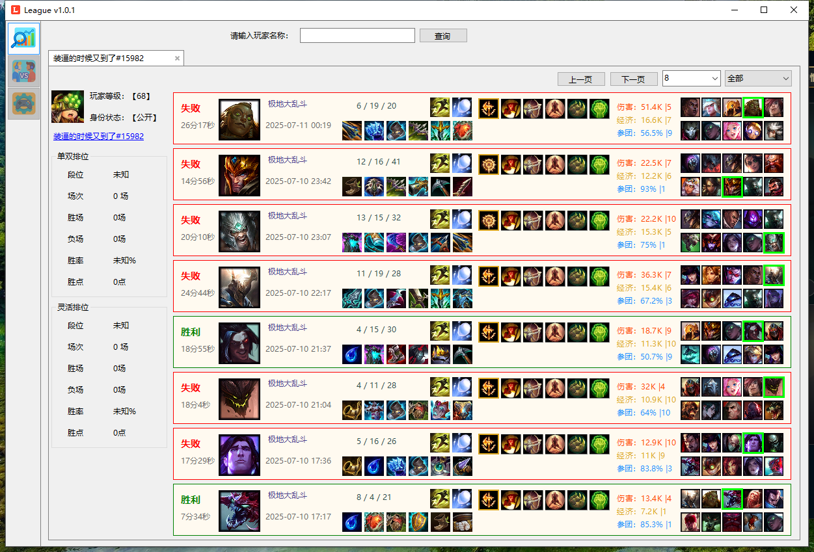
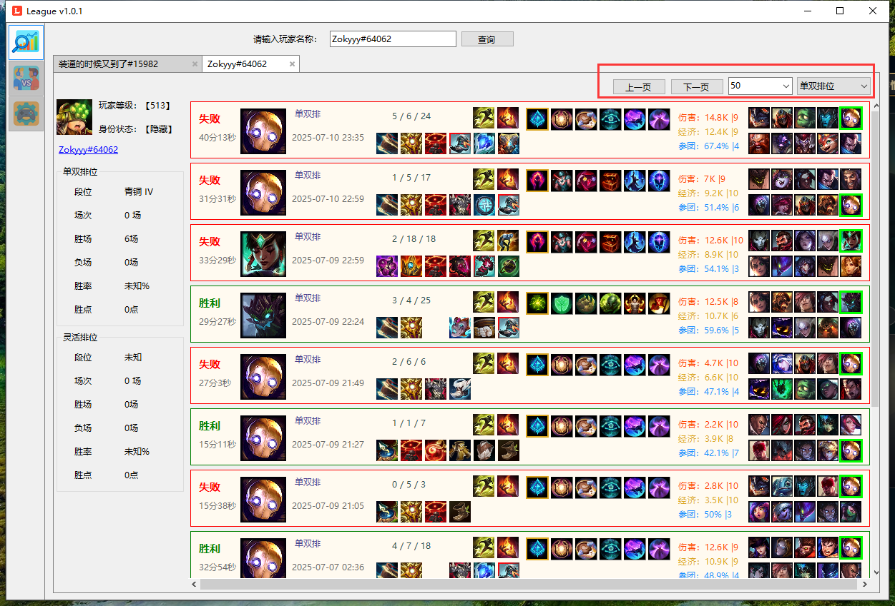
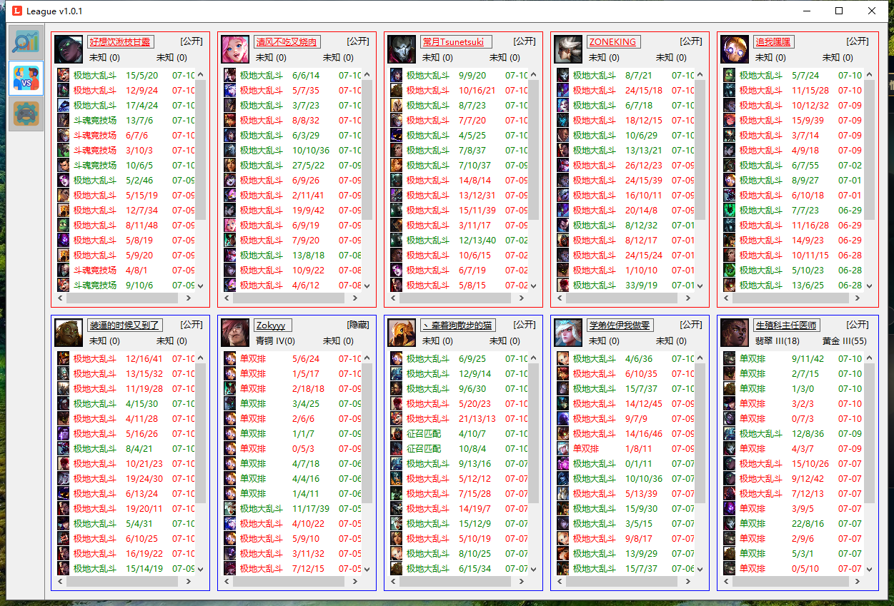

## 英雄联盟战绩查询工具
- #### 1.软件启动后自动查询当前玩家的战绩
	- ##### 包括胜负、KDA、出装、符文配置（默认只能查到主系符文与副系符文，符文碎片查询不到）
	- ##### 本场游戏的伤害、经济、参团率及这三项在10名玩家中的排名，这些数据都是与WeGame查询到的一样  

- #### 2.能够筛选查询的数据，如匹配、单双排、灵活（默认查询50场）会较慢一点

- #### 3.在客户端开始匹配游戏时会自动跳转到第二个界面，会自动查询我方队伍与敌方队伍的近期20场战绩数据
	- ##### 以及显示是否组队玩家，如果是组队的，则名称为相同颜色

## 具体界面如下：

